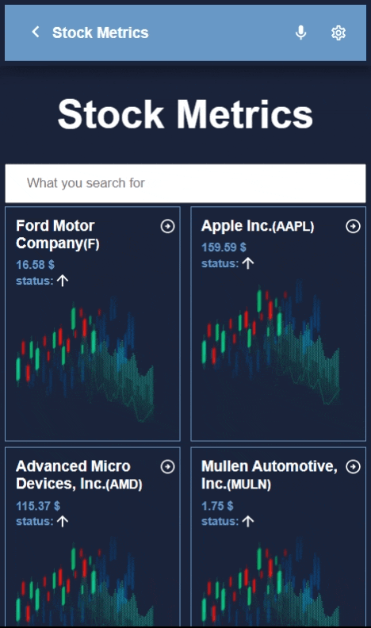

<!--
HOW TO USE:
This is an example of how you may give instructions on setting up your project locally.

Modify this file to match your project and remove sections that don't apply.

REQUIRED SECTIONS:
- Table of Contents
- About the Project
  - Built With
  - Live Demo
- Getting Started
- Authors
- Future Features
- Contributing
- Show your support
- Acknowledgements
- License

OPTIONAL SECTIONS:
- FAQ

After you're finished please remove all the comments and instructions!
-->

  <!-- You are encouraged to replace this logo with your own! Otherwise you can also remove it. -->
  
   

  <h3><b>Microverse README Template</b></h3>

<!-- TABLE OF CONTENTS -->

# 📗 Table of Contents

- [📖 About the Project](#about-project)
  - [🛠 Built With](#built-with)
    - [Tech Stack](#tech-stack)
    - [Key Features](#key-features)
  - [🚀 Live Demo](#live-demo)
- [💻 Getting Started](#getting-started)
  - [Setup](#setup)
  - [Prerequisites](#prerequisites)
  - [Install](#install)
  - [Usage](#usage)
  - [Run tests](#run-tests)
  - [Deployment](#triangular_flag_on_post-deployment)
- [👥 Authors](#authors)
- [🔭 Future Features](#future-features)
- [🤝 Contributing](#contributing)
- [⭐️ Show your support](#support)
- [🙏 Acknowledgements](#acknowledgements)
- [❓ FAQ (OPTIONAL)](#faq)
- [📝 License](#license)

<!-- PROJECT DESCRIPTION -->

# 📖 [Stock Metrics Webapp] 

> Stock Metrics is a web(mobile-focused) software for monitoring the stock exchange's listed firms and seeing their live metrics. It uses data from the Financial Modeling API. 

## 🛠 Built With 

  <ul>
    <li>HTML</li>
    <li>CSS</li>
    <li>JavaScript</li>
    <li>React</li>
    <li>Webpack</li>
    <li>chart js</li>
    <li>redux</li>  
    <li>React Testing Library</li>
    <li>jest</li>  
    <li>linter</li>
  </ul>

### Tech Stack 

  
Client

  <ul>
    <li><a href="https://reactjs.org/">React.js</a></li>
  </ul>

  
Server

  <ul>
    <li><a href="https://expressjs.com/">Express.js</a></li>
  </ul>

Database

  <ul>
    <li><a href="https://www.postgresql.org/">PostgreSQL</a></li>
  </ul>

<!-- Features -->

### Key Features 

> Describe between 1-3 key features of the application.

 - [x] created pages folder for the structure of the pages.
 - [x] Wrote tests
 - [x] Added a 404 error page
 - [x] Added a loader to help keep users waiting while data is being fetched
 - [x] Added dynamic routing the details page
 - [x] Implemented search bar functionality using reducers and redux store
 - [x] Implemented charts to present the dynamically generated net income and gross profit in a line chart and bar chart.

(<a href="#readme-top">back to top</a>)

<!-- LIVE DEMO -->

## 🚀 Live Demo 

> Add a link to your deployed project.

- [Live Demo Link](https://yourdeployedapplicationlink.com)

(<a href="#readme-top">back to top</a>)

<!-- GETTING STARTED -->

## 💻 Getting Started 

To get a local copy up and running, follow these steps.

### Prerequisites

In order to run this project you need:

- node.js
- git

### Setup

Clone this repository to your desired folder:

- Open your terminal

- Navigate to the directory where you want to clone the project.

- Clone the project using by running the following command:

`git clone https://github.com/osamaashraf6/Metrices-Webapp.git`

### Install

Install this project with: node js, run this command `npm install` in the terminal

### Usage

To run the project, execute the following command:

- `npm run build`
- `npm run start`

### Run tests

To run tests, run the following command:

- `npm run test`

### Deployment

You can deploy this project using: `npm run deploy`

(<a href="#readme-top">back to top</a>)

<!-- AUTHORS -->

## 👥 Authors 

> Mention all of the collaborators of this project.

👤 **Author1**

- GitHub: [Osama Ashraf](https://github.com/osamaashraf6)
- Twitter: [Osama Ashraf](https://twitter.com/OsamaAshraf578?t=l75KjrhQgK4h-vSPfgk1gA&s=08)
- LinkedIn: [Osama Ashraf](https://www.linkedin.com/in/osama-salem-2a046b203)

(<a href="#readme-top">back to top</a>)

<!-- FUTURE FEATURES -->

## 🔭 Future Features 

> Describe 1 - 3 features you will add to the project.

- [ ] **I will enhance the code in the future and try to add some new things💯**

(<a href="#readme-top">back to top</a>)

<!-- CONTRIBUTING -->

## 🤝 Contributing 

Contributions, issues, and feature requests are welcome!

Feel free to check the [issues page](../../issues/).

(<a href="#readme-top">back to top</a>)

<!-- SUPPORT -->

## ⭐️ Show your support 

If you like this project feel free to leave a star ⭐️

(<a href="#readme-top">back to top</a>)

<!-- ACKNOWLEDGEMENTS -->

## 🙏 Acknowledgments 

- [x] I would like to thank Microverse for motivating me to build this beautiful project💯
- [x] Original design idea by [Nelson Sakwa on Behance..](https://www.behance.net/gallery/31579789/Ballhead-App-%28Free-PSDs%29) Under the [Creative Commons License](https://creativecommons.org/licenses/by-nc/4.0/)👌

(<a href="#readme-top">back to top</a>)

<!-- FAQ (optional) -->

## ❓ FAQ 

- **[How to run this project?]**

  - [You need to have [Node.js](https://nodejs.org/en/download/) in your local machine, and in the root of the project write `npm run start` in the terminal]

- **[Is it open source?]**

  - [Yes you are allowed to use this project]

(<a href="#readme-top">back to top</a>)

<!-- LICENSE -->

## 📝 License 

This project is [MIT](./LICENSE) licensed.

_NOTE: we recommend using the [MIT license](https://choosealicense.com/licenses/mit/) - you can set it up quickly by [using templates available on GitHub](https://docs.github.com/en/communities/setting-up-your-project-for-healthy-contributions/adding-a-license-to-a-repository). You can also use [any other license](https://choosealicense.com/licenses/) if you wish._

(<a href="#readme-top">back to top</a>)

